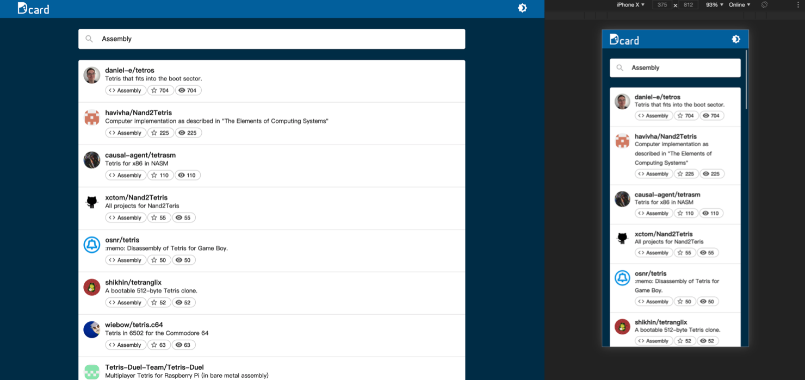
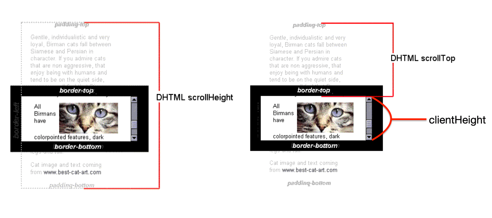
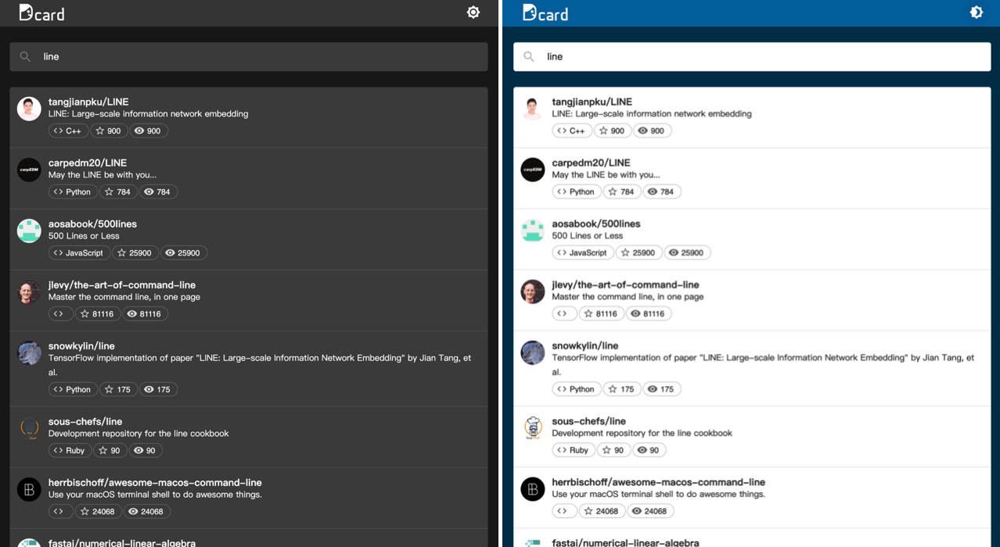
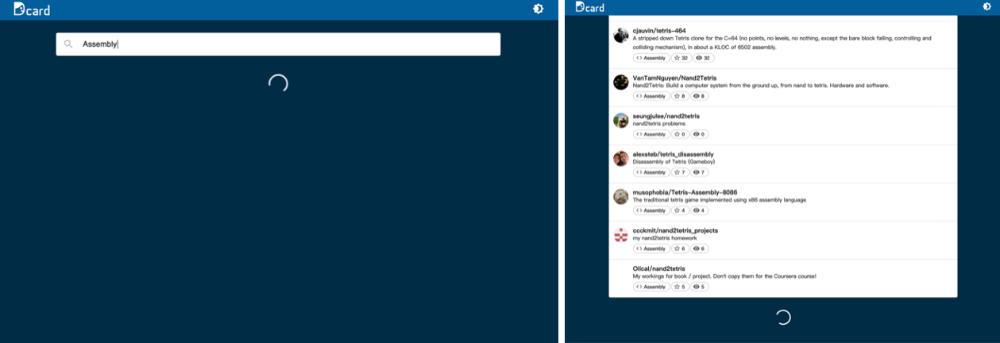
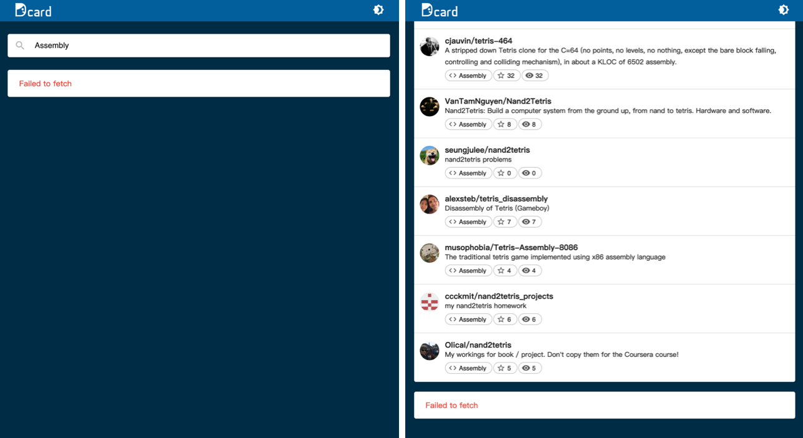

# Github repos search

[Demo](https://timingjl.github.io/github-repos-search/)

## Getting started

```shell
nvm use 12
npm install
npm start
```

## Highlight

- [x] RWD
- [x] infinite scroll (滾到頁面底部時自動載入)
- [x] Typescript
- [x] Dark mode (change theme)
- [x] 避免過於頻繁的 API requests (using debounce)
- [x] Fetch failed handling
- [x] Dcard like styling
- [x] 透過 React.memo 減少不必要的重複渲染

## Description

### RWD



我選用的 React UI framework 是 `Material-UI`。

比較常見的做法是直接在 CSS 裡面寫 media query。但 Material-UI 也提供我們 useMediaQuery 這個 hook 幫助我們偵測螢幕的大小。

useStyles 也提供我們能夠傳入 props 來改變樣式，所以比起傳統的 CSS 作法， JSS 讓我們在做動態的樣式改變的時候，看起來更有邏輯性。

```js
const matches = useMediaQuery('(min-width: 768px)');
const classes = useStyles({ matches });
```

另外，`Material-UI` 也提供 `<Container />` 這個容器元件，透過他可以幫助我們完成水平置中的佈局，並且能夠適應螢幕大小。

### Infinite Scroll

滾到頁面底部時自動載入。

由下面圖片可以知道， Element.scrollTop + Element.clientHeight >= Element.scrollHeight 的時候，就表示滑到底部了。

我們可以透過 onScroll event 來不斷觀察是不是已經滑到底部。



滑到底部時，檢查一下 github repositories 是不是後面還有資料，如果沒有，就發 request 去拿後面的資料。

```js
const handleOnScroll = useCallback(() => {
  const mainContentElem = mainContentRef.current;
  if (mainContentElem) {
    const scrollPos = mainContentElem.scrollTop + mainContentElem.clientHeight;
    const divHeight = mainContentElem.scrollHeight;
    if ((scrollPos >= divHeight) && !isLastPage) {
      handleLoadRepositories({ queryString, page, perPage })
    }
  }
}, [mainContentRef]);
```

### Dark mode (change theme)

一個應用程式或是網站如果能夠做到改變主題，意味著它的顏色或樣式有被抽出來做有系統的管理，而不是把樣式和顏色色票直接寫死在 css 裡面。

這邊我透過 Material-UI 提供的 ThemeProvider 簡單來抽換所需要的顏色和樣式。
並且透過 theme/index.js 來統一管理。

設計師通常會在做網站設計之前，先制定一份 `guideline` ，可能會遵循`原子設計方法論(Atomic Design)`，概念就像是現實世界當中，所有東西都是由原子組成分子、分子組成組織，從小顆粒度的原子慢慢到大顆粒度的物體。

因此當 guideline 訂定出來之後，設計師也不能胡亂憑感覺設計，所有設計也都需要遵照 guideline 來做統一的設計，確保整個網站的樣式一致。

因此前端工程如果使用 ThemeProvider 的話，就能夠與此原子設計方法的概念搭配。未來假設 guideline 有所調整或改變，工程師也不用逐一檢查每個元件的樣式是否符合 guideline ，只需要在樣式管理裡面做調整，就能夠確保網站所有元件符合 guideline 的樣式。

```jsx
<ThemeProvider theme={themes[themeIndex]}>
  <MainPage
    handleChangeTheme={handleChangeTheme}
    isDarkMode={themeIndex === 1}
  />
</ThemeProvider>
```



### 避免過於頻繁的 API requests

題目要我們做 `偵測文字輸入框的變動，並查詢相關的 GitHub repos`。

```jsx
<InputBase
  className={classes.input}
  placeholder="Github repos search"
  inputProps={{ 'aria-label': 'Github repos search' }}
  onChange={handleOnChange}
/>
```

由於這邊發出 request 的時機是 onChange 的時候，不是 onSubmit ，因此會發生每打一個字就發出一個 request 的頻繁請求。

比起一打字就發出請求，我們希望能夠在使用者「不動作一段時間」之後再發出請求，簡單實現方法可以透過加入一個 setTimeout 計時器，如果事件一直觸發，便刷新計時器，直到計時器時限內沒有觸發該事件，便執行事件行為。

```js
function debounce(func, delay=250) {
  let timer = null;

  return () => {
    let context = this;
    let args = arguments;

    clearTimeout(timer);
    timer = setTimeout(() => {
      func.apply(context, args);
    }, delay)
  }
}
```

但由於這個專案是透過 `redux-observable` 來處理非同步的 API 請求，他提供我們使用可讀性高的宣告式語法來做到 debounce。

如下所示，這邊設定為使用者不動作超過一秒，會幫忙把目前的 queryString 發送出去查詢。

```js
const fetchRepositoriesEpic = (action$) => {
  return action$.pipe(
    ofType(FETCH_REPOSITORIES),
    debounceTime(1000),
    switchMap(({ payload }) => {
      /* 發送 request */
    })
  );
};
```

### Redux-observable

react + redux 處理非同步的方法有很多種，這邊我們選用 redux-observable。

redux-observable 是基於 rxjs 的 redux middleware。他提供一些方便的宣告式語法幫助我們處理一些複雜的非同步問題。例如上述 debounce 就是其中之一。

本專案有用到的語法說明如下：

**switchMap**
switchMap 其實就是 map 加上 switch 簡化的寫法。switch 最重要的就是他會在新的 observable 送出後直接處理新的 observable 不管前一個 observable 是否完成，每當有新的 observable 送出就會直接把舊的 observable 退訂(unsubscribe)，永遠只處理最新的 observable!

switchMap 可以幫助我們處理當頻繁且密集地發 request 的時候，永遠只處理最新的 request。

Marble Diagram：
```
click  : ---------c-c------------------c--..
        map(e => Rx.Observable.interval(1000))
source : ---------o-o------------------o--..
                   \ \                  \----0----1--...
                    \ ----0----1----2----3----4--...
                     ----0----1----2----3----4--...
                     switch()
example: -----------------0----1----2--------0----1--...
```

**mergeMap**

mergeMap 其實就是 map 加上 mergeAll 簡化的寫法。mergeAll 會把二維的 observable 轉成一維的，並且能夠同時處理所有的 observable。

Marble Diagram：
```
click  : ---------c-c------------------c--.. 
        map(e => Rx.Observable.interval(1000))
source : ---------o-o------------------o--..
                   \ \                  \----0----1--...
                    \ ----0----1----2----3----4--...
                     ----0----1----2----3----4--...
                     switch()
example: ----------------00---11---22---33---(04)4--...
```

這邊我們用 mergeMap 來把 response 轉換攤平成 plain objects 並逐一處理。


非同步請求的時候，我們也需要去處理各種非同步狀態：

- pending: 等待中的初始狀態
- fulfilled: 正確完成
- rejected: 已拒絕，操作失敗

Epic function 可以接收 action 也可以發送出 action 。

收到要 fetch repos api 的 action 之後，透過 `startWith()` 這個函式，可以讓我們在發出正式請求之前先發出一個 action 到 reducer，把狀態設為 `loading` ，因此拿到 loading 狀態為 true 的時候，我們可以在畫面上 show 出 loading 的樣式(ex: 轉圈圈)。

當 response 回來之後，又可以再發一個 action 到 reducer 改變狀態，因此我們可以更新畫面上的 repos 資料。



透過 `catchError` 也可以幫助我們處理一些請求失敗的狀態，例如網路斷線的時候，會擷取到 fetch failed 狀態，並發出一個 action 到 reducer 改變狀態，讓我們在畫面上能做出對應的處理，不會讓網頁因此壞掉。



### memo

hook 當中提供我們使用 memo, useMemo 來減少多餘的渲染所造成性能上的浪費。

例如畫面上 repositories list 的每一個 item 不應該一直被更新，所以我們可以用 memo 把它包起來。

```jsx

const RepositoryItem = ({ item }: IRepositoryItem) => {
  const classes = useStyles();
  const { owner } = item;
  return (
    <div className={classes.root}>
    {/* 省略 */}
    </div>
  );
};

export default memo(RepositoryItem);
```
